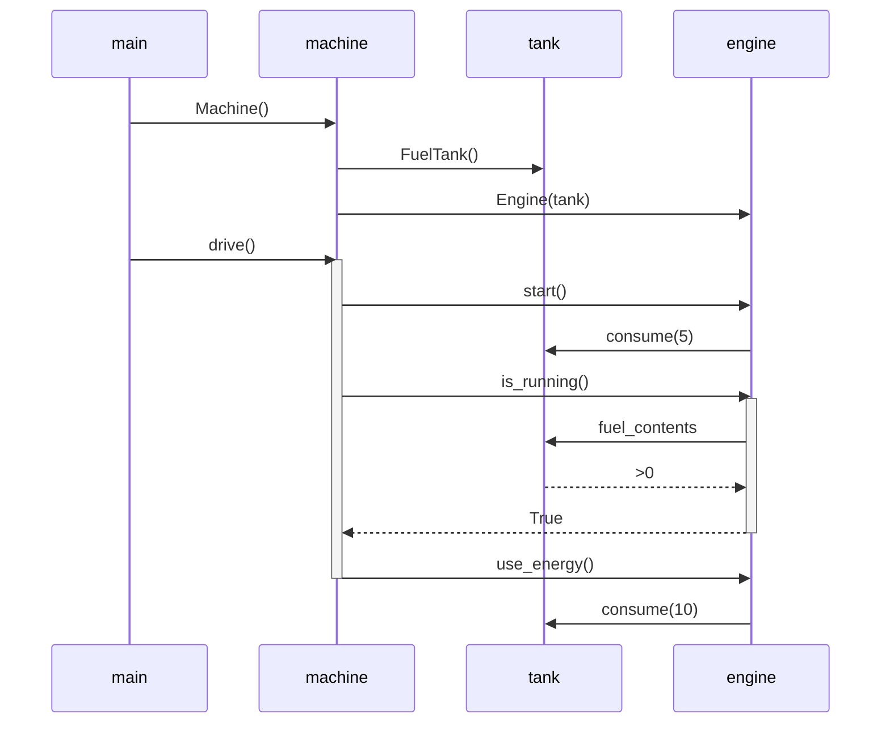

```mermaid
sequenceDiagram

    participant main
    participant machine
    participant tank
    participant engine
    
    main ->> machine: Machine()
    machine ->> tank: FuelTank()
    machine ->> engine: Engine(tank)
    
    main ->> machine: drive()
    activate machine
    machine ->> engine: start()
    engine ->> tank: consume(5)
    machine ->> engine: is_running()
    activate engine
    engine ->> tank: fuel_contents
    tank -->> engine: >0
    engine -->> machine: True
    deactivate engine
    machine ->> engine: use_energy()
    deactivate machine
    
    engine ->> tank: consume(10)
```
