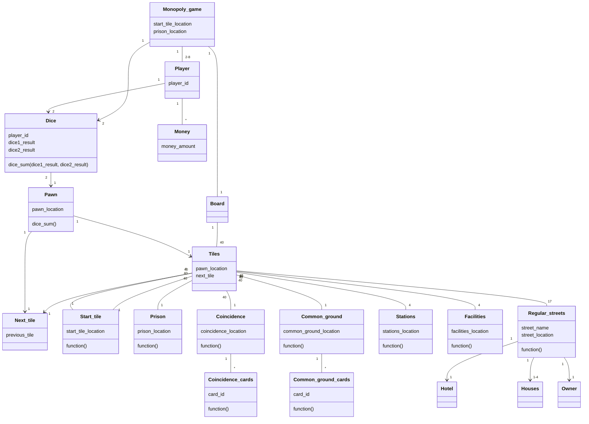

```mermaid
 classDiagram
      Monopoly_game "1" -- "2-8" Player 
      Monopoly_game "1" --> "2" Dice
      Monopoly_game "1" -- "1" Board
      Board "1" -- "40" Tiles
      Tiles "1" --> "1" Next_tile
      Player "1" --> "2" Dice
      Dice "2" --> "1" Pawn
      Pawn "1" --> "1" Tiles
      Pawn "1" --> "1" Next_tile
      Tiles "40" -- "1" Start_tile
      Tiles "40" -- "1" Prison
      Tiles "40" -- "1" Start_tile
      Tiles "40" -- "1" Coincidence
      Tiles "40" -- "1" Common_ground
      Tiles "40" -- "4" Stations
      Tiles "40" -- "4" Facilities
      Tiles "40" -- "17" Regular_streets
      Coincidence "1" -- "*" Coincidence_cards
      Common_ground "1" -- "*" Common_ground_cards
      Player "1" -- "*" Money
      Regular_streets "1" --> "1" Hotel
      Regular_streets "1" --> "1-4" Houses
      Regular_streets "1" --> "1" Owner
      
      class Monopoly_game {
      start_tile_location
      prison_location
      }
      
      class Player {
      player_id
      }
      
      class Dice {
      player_id
      dice1_result
      dice2_result
      dice_sum(dice1_result, dice2_result)
      }
      
      class Pawn {
      pawn_location
      dice_sum()
      }
      
      class Tiles {
      pawn_location
      next_tile
      }
      
      class Next_tile {
      previous_tile
      }
      
      class Start_tile {
      start_tile_location
      function()
      }
      
      class Prison {
      prison_location
      function()
      }
      
      class Coincidence {
      coincidence_location
      function()
      }
      
      class Common_ground {
      common_ground_location
      function()
      }
      
      class Stations {
      stations_location
      function()
      }
      
      class Facilities {
      facilities_location
      function()
      }
      
      class Regular_streets {
      street_name
      street_location
      function()
      }
      
      class Coincidence_cards {
      card_id
      function()
      }
      
      class Common_ground_cards {
      card_id
      function()
      }
      
      class Money {
      money_amount
      }
      
```
