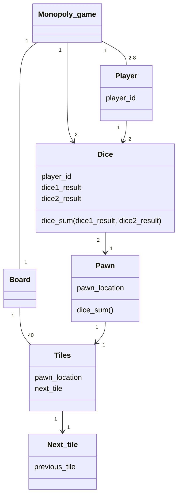

```mermaid
 classDiagram
      Monopoly_game "1" -- "2-8" Player 
      Monopoly_game "1" --> "2" Dice
      Monopoly_game "1" -- "1" Board
      Board "1" -- "40" Tiles
      Tiles "1" --> "1" Next_tile
      Player "1" --> "2" Dice
      Dice "2" --> "1" Pawn
      Pawn "1" --> "1" Tiles
      
      class Player {
      player_id
      }
      
      class Dice {
      player_id
      dice1_result
      dice2_result
      dice_sum(dice1_result, dice2_result)
      }
      
      class Pawn {
      pawn_location
      dice_sum()
      }
      
      class Tiles {
      pawn_location
      next_tile
      }
      
      class Next_tile {
      previous_tile
      }
      
```
