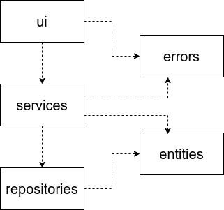
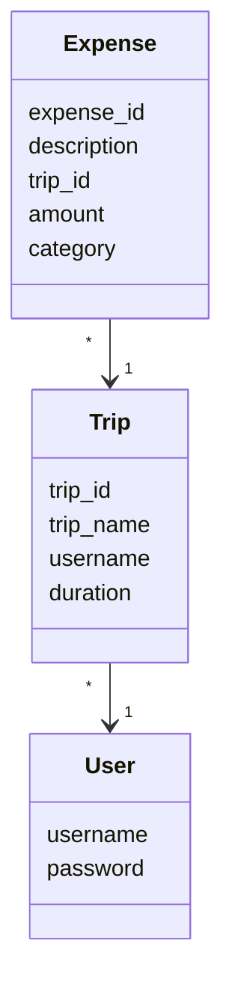
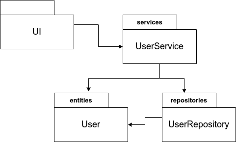
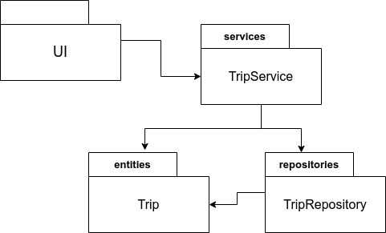
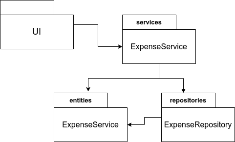
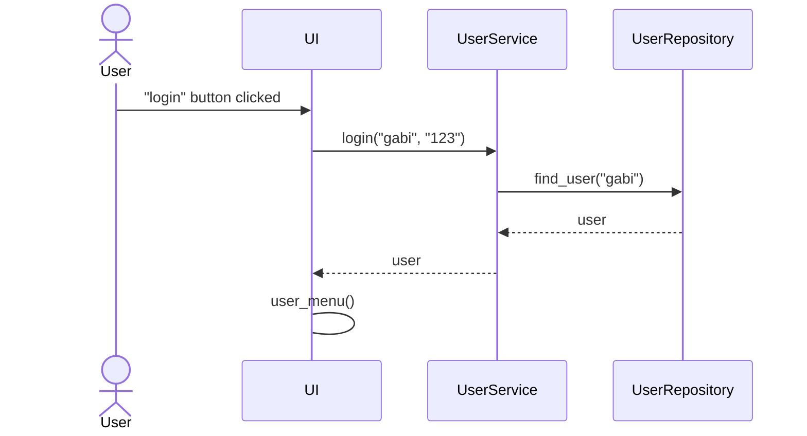
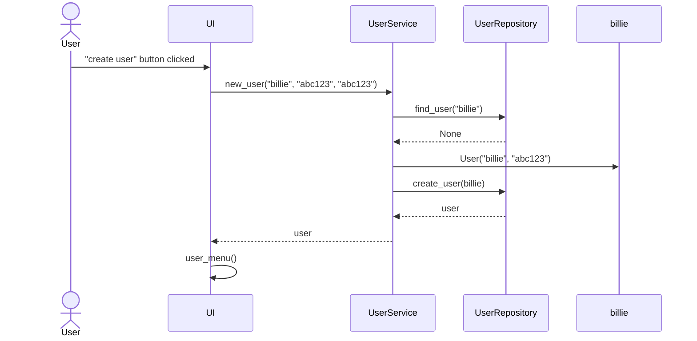

# Architectural description

## Structure
The packing structure of the application is as follows:  
  
- the package `ui` is responsible for the user interface
- the package `services` is responsible for the application logic
- the package `respositories` is responsible for permanent storage of the data
- the package `entities` contains classes that that reflect the data objects of the application
- the package `errors` is responsible for handling errors

## User interface
User interface contains the following views:
- login 
- create user
- main menu
- trips list
- create a new trip
- trip view and expenses list
- add an expense
- trip's statistics
- user's statistics
Each view is implemented in its own class. User only sees one view at a time. UI is almost entirely separated from the application logic; it calls the `services` and `errors` packages. 

In the cases of `UserStats` and `TripStats` classes, the statistics data is calculated inside those classes.  

## Application logic
The logical data model of the application consists of the classes `User`, `Trip`, and `Expense`, which describe users, their trips, and expenses of the trips.

The diagram below describes the relationship between classes in the program: 
1. for `User`:  
  
2. for `Trip`:  
  
3. for `Expense`:  
  

## Permanent storage of data
Classes `UserRepository`, `TripRepository`, `ExpenseRepository` from the package *repositories* are responsible for permanent storage of the data. They use the `sqlite3` package to create and manage the database.

## Files
The application stores user, trip, and expense data in the `database.sqlite` file in the corresponding tables. The database is initialized in the [init_database.py](https://github.com/gabikakol/software-dev-exercises/blob/main/travel-budget-app/src/init_database.py) file. The configuration file [.env](https://github.com/gabikakol/software-dev-exercises/blob/main/travel-budget-app/.env) places at the root of the application defines the name of the database file.

# Main functionalities
Below, main functionalities of the application are described using sequence diagrams. 

## User login
When the user enters valid username and password, the application logs the user in the following way: 

## Creating a new user
When the user enters a unique username and two valid, identical passwords, the application creates a new user in the following way:

## Creating a trip

## Adding an expense

## Viewing statistics

### User statistics

### Trip statistics

## Other functionalities
