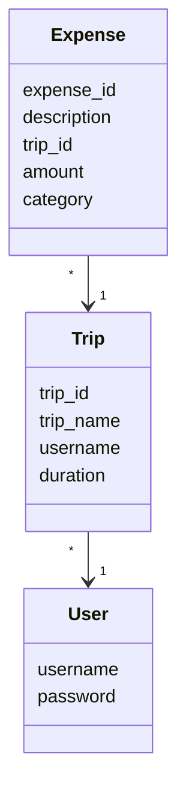

# Architectural description

## Structure
The packing structure of the application is as follows:  
  
- the package `ui` is responsible for the user interface
- the package `services` is responsible for the application logic
- the package `respositories` is responsible for permanent storage of the data
- the package `entities` contains classes that that reflect the data objects of the application
- the package `errors` is responsible for handling errors

## User interface
User interface contains the following views:
- login 
- create user
- main menu
- trips list
- create a new trip
- trip view and expenses list
- add an expense
- trip's statistics
- user's statistics
Each view is implemented in its own class. User only sees one view at a time. UI is almost entirely separated from the application logic; it calls the `services` and `errors` packages. 

In the cases of `UserStats` and `TripStats` classes, the statistics data is calculated inside those classes.  

## Application logic
The logical data model of the application consists of the classes `User`, `Trip`, and `Expense`, which describe users, their trips, and expenses of the trips.

The diagram below describes the relationship between classes in the program: 
1. User  
  
2. Trip  
  
3. Expense  
  

## Permanent storage of data

## Files

# Main functionalities

## Creating a new user

## Creating a trip

## Adding an expense

## Viewing statistics

### User statistics

### Trip statistics

## Other functionalities
