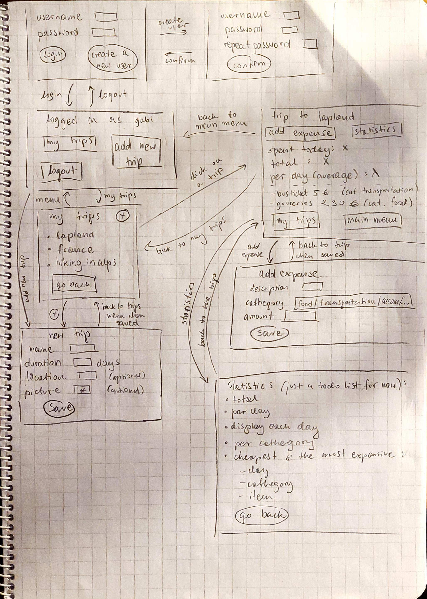

# Specification

## Purpose
The purpose of the app is to track the spendings while traveling, divide them into cathegories, and see the statistics (total, per day, per cathegory, the cheapest and the most expensive) of both current and past trips. 

## Users
The program is used by one user at the time. Each user has an unique username and a non empty password. Users do not interact with other users. Each user has its own trips with statistics. 

## User interface plan
 

## Functionality
(describe what's going on on the pic)

## Further development
- users interact with each other, for example splitting the costs 
- expense and trip deletion
- user deletion
