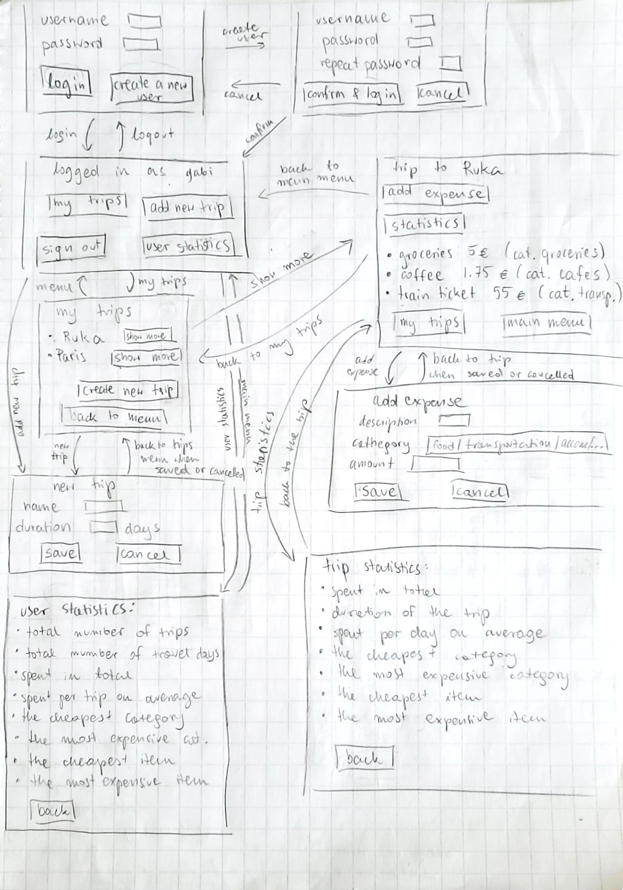

# Specification

## Purpose
The purpose of the app is to track the spendings while traveling, divide them into cathegories, and see the statistics (total, per day, the cheapest and the most expensive) of both current and past trips. 

## Users
The program is used by one user at the time. Each user has an unique username and a non-empty password. Users do not interact with other users. Each user has its own trips with expenses, and statistics. 

## User interface
 

## Functionality

### Before login
- New user:
    - creates an unique username
    - created a valid password
    - system informs if username already exists
- Existing user:
    - logs in using the previosuly created username and the corresponding password
    - system informs if the username is not found or the password is incorrect

### After login
User chooses one of 4 functionalities:
1. My trips
    - redirects to the "My trips" window 
3. Create new trip
    - redirects to the "Create new trip" window
4. User statistics
    - reditects to the "User statistics" window
5. Log out
    - redirects back to login menu 

### Creating new trip
User is asked to input:
- name of the trip
- duration (in days)

### Viewing a trip
- list of expenses displayed
- for each expense:
    - name of expense
    - cost
    - category

### Adding an expense
User is asked to input:
- description
- amount (costs in EUR)
- cathegory (choose from: *groceries, transportation, accommodation, restaurants, bars, cafes, shopping, activities, entertainment, currency exchange comissions, laundry, other*)

### Trip statistics
- spent in total
- duration of the trip
- spent per day (on average)
- the cheapest and the most expensive item/expense
- the cheapest and the most expensive category

### User statistics
- total number of trips
- total number of travel days
- spent in total
- spent per trip on average
- spent per day on average
- the cheapest and the most expensive category 
- the cheapest and the most expensive item/expense

## Further development
- users interact with each other, for example splitting the costs 
- edit or delete expense and trip 
- user deletion
- currency exchange calculator
- adding location and a picture of a trip