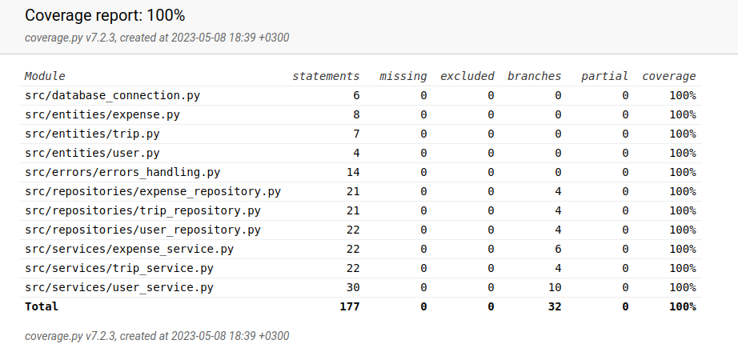

# Testing
The application has been tested with automated unit and integration tests using unittest and with manually performed system level tests. 

## Unit and integration testing

### Application logic

### Repository classes

### Testing coverage
 

## System testing

### Installation and configuration

### Functionalities

## Problems left in the application
