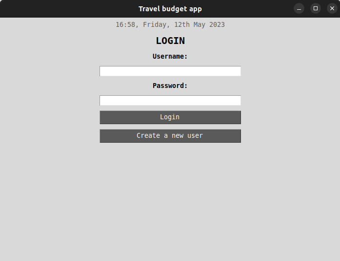
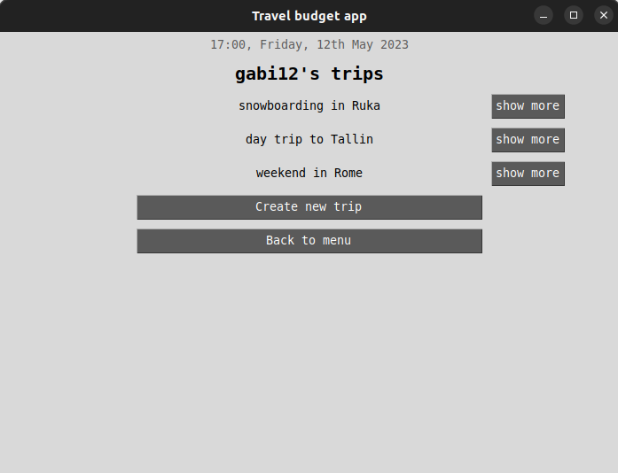
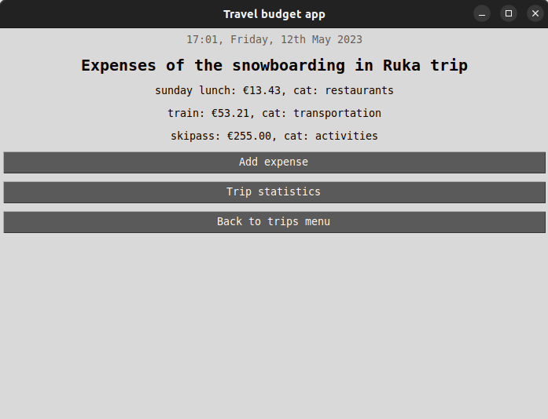
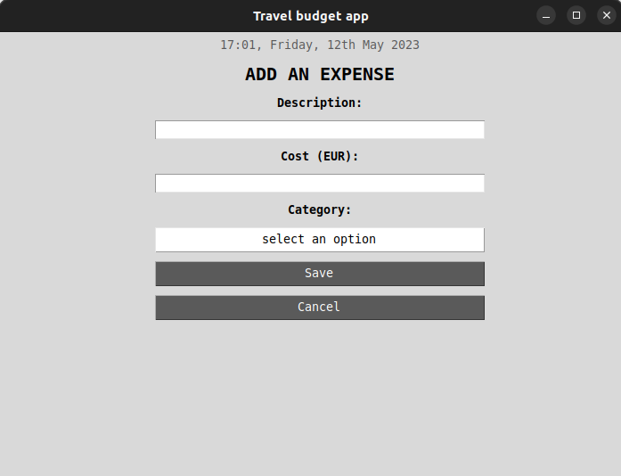
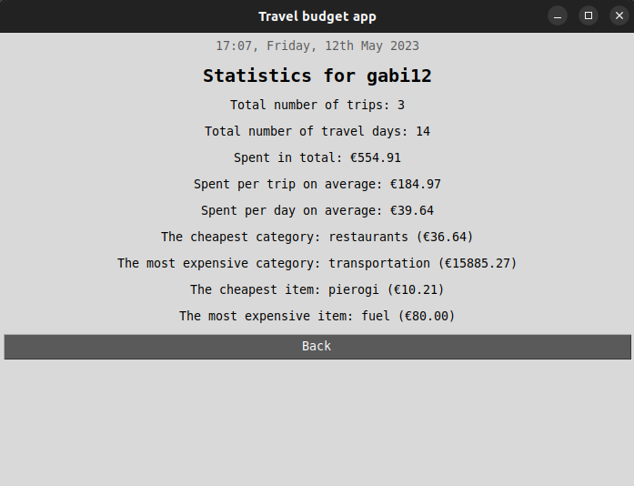

# User manual
Download the latest release of the project from [here](https://github.com/gabikakol/software-dev-exercises/releases)

## Configuration
The name of the file used for saving and storing data can be configured in the *.env* file in the root directory of the project. The file is automatically created in the *data* director. The format of the file is as follows:
```
DATABASE_FILENAME=database.sqlite
```

## Starting the program
Run the following commands in ```/software-dev-exercises/travel-budget-app```
1. Install dependencies with the command:
```
poetry install
```
2. Initialize the project with the command:
```
poetry run invoke build
```
3. Start the program with the command:
```
poetry run invoke start
```

## Login
The program starts with the login window. Log in by entering your username and password, and pressing *Login* (both entries are case sensitive). If you do not have a user account yet, click *Create a new user*. 
</br></br>
 

## Creating new user
Creating new user is done by entering a unique username (all characters are allowed) and password. Password must be confirmed by retyping it in the *Repeat passowrd* field. If the creation is successful, user is logged and redirected to the main menu. 
</br></br>
 

## Main menu
In the main menu, user can view existing trips, create a new trip, view general user's statistics or log out by pressing the corresponding buttons. 
</br></br> 
 

## Creating a new trip
Creating new trip is done by entering trip's name (all characters are allowed) and duration in days (integer value). A new trip is saved by clicking *save* button. 
</br></br>
 

## Trips menu and viewing a trip
After new trip is created, or by clicking *my trips* button from the main menu, user is redirected to the trips list window. Trip's details can be viewed by clicking *show more* button next to trip's name. In the trip's expenses window, user can view list of trip's expenses, create a new expense, and view trip's statistics. 
</br></br>
 
 

## Adding an expense
An expense can be added by clicking *add expense* button in the trip's expenses window. User is asked to input description of the expense, its cost in EUR, and select a category. The cost must be a numeric value and '.' must be used if input is a fraction. An expense is saved by clicking *save* button, after which user is redirected back to trip's details menu. 
</br></br>
 

## Viewing statistics
### User statistics
General user's statistics can be viewed by clicking *user statistics* button from the main menu. Statistics window is exited by clicking *back* button. 
</br></br>
 

### Trip statistics
Trip's statistics can be viewed by clicking *trip statistics* button from the trip's expenses window. Statistics window is exited by clicking *back* button. 
</br></br>
 